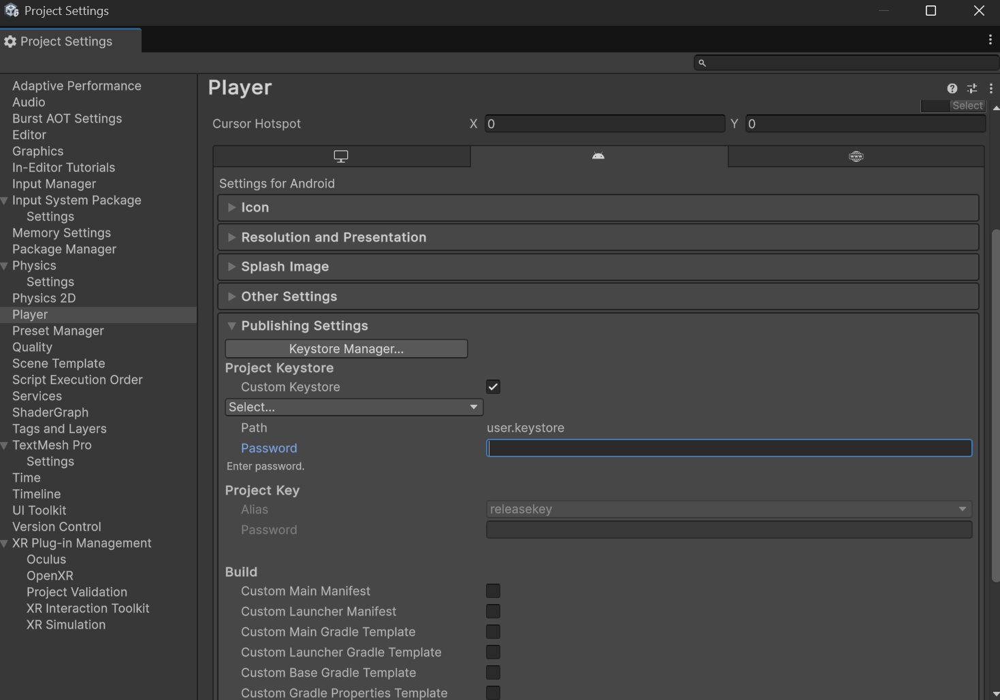

We use a custom keystore instead of the standard one. Normally you can just build immediately to make an .apk, but using a custom keystore instead of the debug one gives us permission to deploy it to the meta store.

THE PASSWORD IS "000000"
